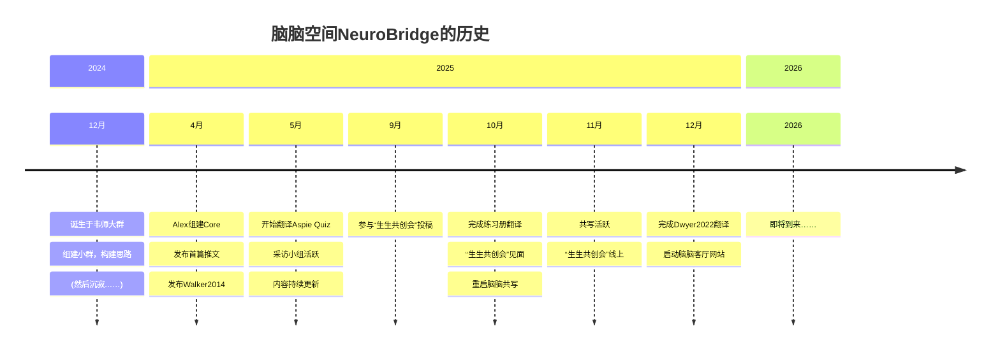

本文首发：[脑脑空间NeuroBridge网站](https://neurobrdge.cn)  
首发时间：2025-12-23  
作者：脑脑空间成员（Alexander、小呆、[XyZ](https://neuroxyz.cn/resource/xyz.html) ） 

内容概要：
- 2024
- 2025

---
## 📍 2024
### 12月
- **12月8日**
    
    脑脑空间开始召集成员并成立群组，迈出第一步。
    
- **12月8日 - 12月19日**
    
    初步构想了账号运营框架，以及成员分工。
    
- **12月19日 - 2025年4月18日**
    
    群组进入沉寂期（俗称“死了”）。
    

---

## 📍 2025

### 4月
- **4月18日**
    
    Alex 组建了脑脑空间 core 核心组，群组正式复活。
    
- **4月22日**
    
    发布了[脑脑发刊词]({})，宣告重新启动。
    
- **4月25日**
    
    发布第一篇内容：[《神经多样性：基本术语与定义》]({})
    
    ➝ 此后开始在小红书与公众号定期更新内容。

### 5月
    
- **5月2日**
    
    成立【翻译小组】，启动 [Aspie Quiz V5](https://rdos.net/china/) 量表的翻译工作。
    
- **5月7日**
    
    成立【采访小组】，翻译与采访成为两大内容支柱。
    
    
- **5月 - 8月**  
    小呆访谈[Artemis]({})、[渔村学生]({})、[C]({})  
    卷访谈[Z17]({})、[Dr.Shevaun Lewis]({})  
    内容持续更新，社群讨论氛围活跃，构建多个主题板块。
    
### 8月
- **8月5日**
    
    第一阶段群组运作告一段落，正式迁移至第二个新群组。

### 9月
    
- **9月20日**
    
    完成“生生知识共创会”投稿两篇。

### 10月
    
- **10月1日**
    
    完成[《神经殊异友好DBT练习册》]({})翻译。
    
- **10月12日**
    
    参加“生生知识共创会”，多名社群成员在广州见面。  
    第二组群运作告一段落，正式迁移至第三季度组群，拓展多名新成员。
    
- **10月18日**
    
    重启脑脑共写（茶话会），完成首篇推送[《脑脑共写：ASDer生活中的自理困难》]({})

### 11月

### 12月
    
- **12月1日**
    
    购买域名：neurobridge.cn
    
- **12月4日**
    
    完成[Dwyer 2022]({})的翻译、排版及推送。
    
- **12月20日**
    
    [脑脑客厅](https://neurobridge.cn)网站https://neurobridge.cn 上线

## 📍 2026
即将到来……

---
我们的小红书：[脑脑空间NeuroBridge](https://www.xiaohongshu.com/user/profile/59b9453c82ec393da71b50a4)  
我们的公众号：[脑脑空间NeuroBridge](https://mp.weixin.qq.com/s/8zczFhhQLW_f4nRf2UGP7Q)

