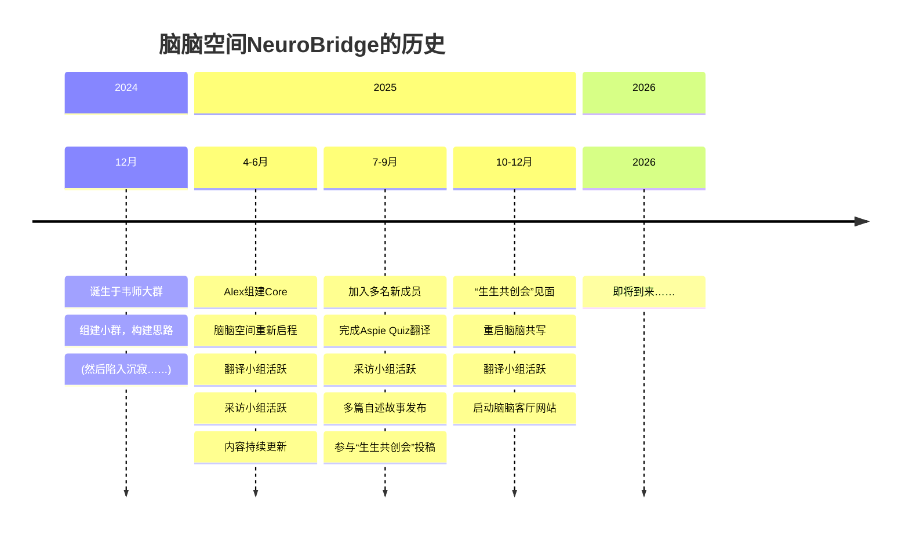

作者：脑脑空间成员（Alexander、[小呆](https://xhslink.com/m/A0TGop1zIv4)、[XyZ](https://neuroxyz.cn/resource/xyz.html) ） 

内容概要：
- 2024
- 2025
- 2026

---

---
## 📍 2024
### 12月

- **12月5日**

    韦师生活妙招（[微信公众号](https://mp.weixin.qq.com/s/_REw5csFFyRdB4N1teNOdw)、[小红书](https://xhslink.com/m/619sOluNMB9)）的ND社群中，成员们围绕自我倡权、社群经验等议题积极讨论。一些群友迫切地想对外倡导，发出自己的声音。

- **12月8日**  

    一些群友开始召集成员并成立新的微信小群组，迈出第一步。
    
- **12月8日 - 12月19日**  

    初步构想了账号名称、运营框架以及成员分工。  

    （“脑脑空间”的账号名称同样来源于韦师的发明，韦师在一篇文章里提到了“正常人类没有脑脑空间”，指心中的“思考的空间，一个泡泡”，详见：[自闭症关注日？| 没关系，普通人，我接纳你！](https://mp.weixin.qq.com/s/4dYeTddvOkgFgTqOFRMg5g)。   
    韦师已授权脑脑空间使用她发明的词汇作为名称。）
    
- **12月19日 - 2025年4月18日**
    
    群组进入沉寂期（俗称“死了”）。
    

---

## 📍 2025

### 4月

- **4月18日**
    
    Alex 组建了脑脑空间 core 核心组，群组正式复活。  

    之后的几日，小呆创建了脑脑空间的Notion空间，[睿睿](https://xhslink.com/m/4xYTTEx1N06)创建了脑脑空间[微信公众号](https://mp.weixin.qq.com/s/8zczFhhQLW_f4nRf2UGP7Q)，XyZ创建了脑脑空间[小红书](https://www.xiaohongshu.com/user/profile/59b9453c82ec393da71b50a4) ，脑脑矩阵成功建立。
    
- **4月22日**
    
    发布了脑脑空间的第一篇推送：[脑脑启程丨一张车票，一段旅程，一个世界]({})，作者：Rosaa，排版：Rossa、XyZ（小红书），宣告脑脑空间正式重新启动。
    
- **4月25日**
    
    发布第一篇内容：[翻译丨Walker（2014）：神经多样性：基本术语与定义]({})，翻译志愿者：Alexander、Rossa、XyZ，排版：小呆（小红书）、Rossa（公众号）、XyZ（小红书）。
    
    ➝ 此后，脑脑空间开始在小红书与公众号（不）定期更新内容。

### 5月
    
- **5月2日**
    
    成立【翻译小组】，启动 [Aspie Quiz V5](https://rdos.net/china/) 量表的翻译工作（详见页面[测试丨Aspie Quiz V5 中文版]({})，翻译志愿者：Alexander Ma马张骏骐、蓝俊雄、欧阳睿泽、XyZ。

- **5月5日**

    转发XyZ文章：ND：每个人都有点神经多样性吗？
    
- **5月7日**
    
    成立【采访小组】，翻译与采访成为前期两大内容支柱。

- **5月10日及之后**

    发布小呆访谈Artemis：[Artemis的生命故事丨“当我不再用‘正常人’的标准衡量自己”s]({})，访谈者：小呆，主人公：Artemis，排版：小呆（小红书）、Rossa（公众号）、Alexander（公众号）。

- **5月11日**

    发布小呆访谈渔村学生：[渔村学生的生命故事丨主线暂停，支线照常进行中]({})，访谈者：小呆，主人公：渔村学生，排版：小呆（小红书）、Rossa（公众号）。
    
- **5月12日**

    发布小呆访C：[C的生命故事丨不被定义的时光]({})，访谈者：小呆，主人公：C，排版：小呆（小红书）、Rossa（公众号）。

- **5月14日**

    发布小呆访聪聪：[聪聪的生命故事丨ASD的我，刚刚开始的故事]({})，访谈者：小呆，主人公：聪聪，排版：小呆（小红书）、XyZ（公众号）。

- **5月23日**

    发布C访谈面包：[面包的个人探索丨确诊ASD之后，我开始脱下面具]({})，访谈者：C，主人公：面包，排版：小呆（小红书）、XyZ（公众号）。

    后续社群讨论氛围活跃，构建多个主题板块。

- **5月29日**

    转发小呆演讲：容纳不同节奏的城市：神经多样性城市建设的构想

### 6月

- **6月3日**

    发布Alexander与peihan的对话：[Alexaner & peihan丨在误解中生长：神经多样性与我们所处的世界]({})，对谈双方：Alexander、peihan，排版：小呆（小红书）。

- **6月10日**

    发布小呆访谈：[洗碗机的生命故事丨在面包店探索喜欢的生活]({}) ，访谈者：小呆，主人公：洗碗机，排版：小呆（小红书）。

- **6月21日**

    10位脑脑空间成员在上海见面，中午在锦炙聚餐。

- **6月27日**

    发布群聊记录：ND填报高考志愿那点事儿，整理和排版：小呆（小红书）。

### 7月

- **7月3日**

    发布Admin文章：“你让让他又怎么了”，作者：Admin，排版：小呆（小红书）。

- **7月8日**

    发布嘉嘉发起的讨论了[嘉嘉丨ND与NT的生日]({}) ，作者：嘉嘉，参与者：鲸鱼、苯乙酸、希达、困、ano、匿名、晴君、孤独星球的小肥啾、嘉嘉，排版：小呆（小红书）。

- **7月9日**

    发布卷访谈z17：[z17丨拥有谱系身份的研究者：“双重视角”下的孤独症研究]({})，访谈者：卷，主人公：z17，排版：小呆（小红书）、披垒是什么不知道（公众号）。

- **7月18日**

    发布Alexander：[成年ASDer的沟通方式偏好]({})，作者：Alexander，排版：Alexander（公众号）。

- **7月下半月**

    [睿睿](https://xhslink.com/m/4xYTTEx1N06)来到上海，与Alex、XyZ等朋友交流，翻译小组完成了Aspie Quiz V5的翻译工作：[测试丨Aspie Quiz V5 中文版]({})。
    
### 8月

- **8月4日**

    发布Admin文章：角色期望与语言风格错位，作者：Admin，排版：小呆（小红书）。

- **8月5日**
    
    第一阶段群组运作告一段落，正式迁移至第二个新群组。

    发布Admin文章：Meltdown在中文语境中的表述困境，作者：Admin，排版：小呆（小红书）。

- **8月8日**

    发布Admin文章：如何避免“高功能”成为一种标签，作者：Admin，排版：小呆（小红书）。

- **8月11日**

    发布JarvieK评论文章：[JarvieK丨发散性思维：天才的火花，还是失控的症状？]({})，作者：JarvieK，内容整理：Admin，排版：小呆（小红书）。

- **8月12日**

    发布[睿睿](https://xhslink.com/m/4xYTTEx1N06)、Admin文章：[睿睿、Admin丨孤独症人士的教育与工作：他们不是例外，而是多样性的一部分]({})，作者：睿睿、Admin，排版：睿睿（公众号）。

- **8月13日**

    发布阿米的外部视角文章：[阿米丨跨越脑间的桥梁：当NT开始了解ND]({})，作者：阿米，注释和排版：小呆（小红书）。

- **8月18日**

    发布大发的故事：[大发丨梦境：不可思议的修复]({})，作者：大发，文案整理：小呆，排版：睿睿（公众号）。

    发布群聊记录：赛博确诊，排版：小呆（小红书）。

- **8月19日**

    发布群内共识再思考，整理和排版：小呆（小红书）。

- **8月22日**

    发布大发的故事：[大发丨确诊故事分享：无限包容，继续前进]({})，作者：大发，排版：小呆（小红书）。

- **8月22日**

    发布JarvieK文章：什么是“有效管理和健康表达感情”，作者：JarvieK，排版：小呆（小红书）。

### 9月

- **9月9日**

    发布小呆友邻推荐：日本神经多样性协会，作者：小呆，排版：小呆（小红书）。

- **9月9日**

    发布小呆访谈Évariste：跨越中日的桥梁，访谈者：小呆，主人公：Évariste，排版：小呆（小红书）。

    发布Admin文章：ND支持性社群的实践思考，作者：Admin，排版：小呆（小红书）。
    
- **9月15日**

    发布群聊记录：关于神经多样性批评及批评的风险，整理和排版：小呆（小红书）。

- **9月19日**

    发布Admin文章：[关于神经多样性运动的四个迷思]({})，作者：Admin，排版：小呆（小红书）、XyZ。
    
- **9月20日**
    
    完成“生生知识共创会”投稿两篇。
    
- **9月23日**

    发布Admin文章：中文ND社群最常见的10个反复性问题，作者：Admin，排版：小呆（小红书）。

- **9月26日**

    发布卷访谈Dr.Shevaun Lewis：[Dr. Shevaun Lewis丨让校园更加ND友好]({}) ，访谈者：卷，主人公：Dr.Shevaun Lewis，整理和排版：小呆（公众号）。

- **9月26日**

    发布夏天的游泳池的故事：[夏天的游泳池丨记一次meltdown（约4/10严重度）]({})，作者：夏天的游泳池，题图：披垒今天吃到草莓蛋糕了吗（公众号），编辑&排版：披垒没有吃到草莓蛋糕（公众号）。

### 10月
    
- **10月1日**
    
    完成[翻译丨神经殊异友好的DBT练习册]({})的翻译、排版和发布，翻译志愿者：Admin 、XyZ 、小呆、披垒、Guillotine、明月潮生，专业审阅：韦亦然，小红书排版：XyZ。

- **10月2日**

    发布XyZ评论文章：[XyZ丨必须批判神经多样性运动]({})，排版：小呆（公众号）。

- **10月6日**

    发布JarvieK故事：我身上有个曾经不可战胜的夏天，作者JarvieK，排版：小呆（小红书）。
    
- **10月12日**
    
    参加“生生知识共创会”，多名社群成员在广州见面。  

    第二组群运作告一段落，正式迁移至第三季度组群，拓展多名新成员。

- **10月16日**

    发布[“神经多样性”的诞生：一段被遗忘的社群历史]({})，作者：XyZ，排版：XyZ（小红书、公众号）。
    
- **10月18日**
    
    重启脑脑共写（茶话会），发布首篇推送[共写 1丨ASDer生活中的自理困难（2025.10）]({})，参与者：XyZ、从从、明月潮生、z17、kariz、Lynn、Xavier、毛肚儿、小呆、披垒、西瓜、睿睿，整理、题图和排版：披垒疼得吱哇乱叫（公众号）。

### 11月

- **11月9日**

    发布Admin评论文章：[Admin丨互联网对ND群体的敌意从何而来?]({})，作者：Admin，排版：小呆（小红书）。

- **11月16日**

    发布第二期脑脑共写：[共写 2丨ND身份披露经验（2025.11）]({})，参与者：从从、Xavier、小呆、匿名、西瓜、J 、允泽、匿名、C，整理、题图和排版：披垒背痛版（公众号）。
    
- **11月17日**

    发布Admin设计的[工具](https://neuroxyz.cn/tests/nsac30.html)：[NSAC-30 神经殊异自理与启动能力简表]({})，作者：Admin，网页：XyZ，排版：Xavier（小红书）。

- **11月21日**

    发布第三期脑脑共写：[共写 3丨在身体里生活：ND伙伴的锻炼/运动经验！（2025.11）]({})，参与者：Xavier、小呆、XyZ、披垒、猫猫日日新、Lynn、Acul,、西瓜、SnOOpY、Admin、彗星、Termi、允泽、C、熊猫鲸，整理、题图和排版：披垒晒太阳睡大觉（公众号）。

- **11月23日**

    发布Admin评论文章：[Admin丨关于神经多样性中“去病化”的讨论]({})，作者：Admin，排版：小呆（小红书）、披垒讨厌阴天（公众号）。

- **11月26日**

    发布[脑脑空间对外协作说明书]({})，声明脑脑空间相对独立的发展路径，作者：Admin等多位脑脑空间成员，排版：小呆（小红书）。

- **11月27日**

    发布第四期脑脑共写：[共写 4丨刻板行为/自我刺激的快乐（2025.11）]({})，参与者：XyZ、Xavier、小呆、西瓜、披垒、Acul、从从、Admin、J、渔村学生、Lynn、明月潮生、充盈压、C、Termi、允泽、熊猫鲸，整理和排版：披垒爱逛公园版（公众号）。

- **11月30日**

    发布Admin评论文章：[Admin丨当我们争论“殊异”时，我们在争论什么？]({})，作者：Admin，排版：XyZ（公众号）。

### 12月
    
- **12月1日**
    
    购买域名：neurobridge.cn
    
- **10月2日**

    发布XyZ评论文章：[“神经多样性-Lite”叙事，抛弃了什么？]({})，作者：XyZ，排版：XyZ（公众号）。
    
- **12月4日**
    
    完成[Dwyer 2022]({})的翻译、排版及推送，翻译：Admin 、Guillotine、XyZ，审校：Rossa、Alexander，排版：小呆（公众号）、XyZ（pdf、小红书）。

- **12月5日**

    转发Miya访谈加拿大巴勒斯坦裔小说作家 Jackie Khalilieh：“哈啰，友人在吗？”，翻译与审校：Miya，排版：小呆（公众号）。

- **12月8日**

    转发vois bunny文章：神经多样性、去病化以及为什么泛自闭光谱者应该团结，翻译与审校：Miya，排版：小呆（公众号）。

- **12月10日**

    发布第五期脑脑共写：[共写 5丨我看“脑脑空间”（2025.12）]({})，参与者：披垒、老北京肌肉卷、呆、渔村学生、Rossa、Lynn、Xavier、匿名、Admin、ASDog、睿睿、XyZ、小春，整理、题图和排版：披垒讨厌冬天没有太阳（公众号）。
    
- **12月20日**
    
    [脑脑客厅](https://neurobridge.cn)网站https://neurobridge.cn 上线

- **12月23日**

    发布第六期脑脑共写：[共写 6丨我们如何过冬（2025.12）]({})，参与者：披垒、空气茧、渔村学生、z17、XyZ、西瓜、ASDog、蓝天C、从从、明月潮生、Josie、Xavier、野人、工程机、J、呆、小春，排版：XyZ（公众号）。

- **12月31日**

    发布脑脑空间2025年度总结，文案：Alexander、呆、XyZ，排版：XyZ（公众号、小红书）。

---

## 📍 2026

### 1月

- **1月2日**

    转发小呆发起的共写：ND群体表达“爱”的共同记录计划（2025），参与者：小呆、Xavier、泠、潇潇、小米、十万分之一、J、小春、XyZ、Admin、小野、小记、睿睿、Z17、Alexander、渔村学生、西瓜，排版制作：小呆。

- **1月6日**

    发布XyZ文章：[神经多样性“去病理化”的三类立场]({})，作者：XyZ，排版：XyZ。

- **1月22日**

    发布小呆故事：[小呆丨我与学习]({})，作者：小呆，排版：小呆。  
    发布Xavier分享：[Xavier丨你使用无障碍设施吗？]({})，作者：Xavier，排版：Xavier。

- **1月23日**

    发布小呆整理文章：[溯源：残障权利运动简史]({})，作者：小呆，排版：小呆。

- **1月24日**

    发布Admin文章：[Admin丨你凭什么戴那个胸针？]({})，作者：Admin，排版：Admin，公众号排版：小呆。

- **1月28日**

    发布论文翻译：[Mandy(2025)：如今，孤独谱系究竟是什么？]({})，作者：Will Mandy，脑脑空间翻译志愿者：  
     翻译：[Admin](https://xhslink.com/m/6e2tpWcngRg)、薛定谔的猫、[睿睿](https://xhslink.com/m/4xYTTEx1N06)、[小蓝](https://mp.weixin.qq.com/s/VLJ9hHCmd3XmJ3P3JKNwlg)（按译文顺序排序）  
     审校：Alexander、[小呆](https://xhslink.com/m/A0TGop1zIv4)、Guillotine、明月潮生、[XyZ](https://neuroxyz.cn) （按首字母排序）

### 2月

- **2月4日**

    发布Rossa文章：[Rossa丨太阳是鸡叫出来的吗？——再谈“殊异”"]({})，作者：Rossa，排版：XyZ。

- **2月8日**

    发布披垒访谈：[弥三郎丨生活教练、临床社会学与神经发散的对话实践]({})，受访者／文字稿修订：沈奕晨（弥三郎），采访者／文字稿整理／排版／题图：披垒 

- **2月24日**

    发布睿睿文章：[睿睿丨浅谈智商与学校的本质：破除标签执念，回归成长本真]({})，作者：睿睿，排版：睿睿。

### 3月

- **3月1日**

    发布白兔兔兔故事：[白兔兔兔丨即使成年后，我仍然严重缺乏个体意识]({})，作者：白兔兔兔，排版：披垒。

- **3月4日**

    发布Admin文章：[Admin丨残障童话：先到的人]({})，作者：Admin，排版：小呆。

- **3月9日**

    发布Alexander文章：关于努力和“懒”：一个脑内对话，作者：Alexander，排版：小呆。

- **3月10日**

    发布脑脑成员文章：[头脑风暴丨ADHD是一种残障吗？]({})，作者：脑脑空间成员，排版：小呆。

    
    
### 4月

- **4月14日**

    发布披垒访谈：[姚然丨当叙事疗法遇上ASD：讲故事，而不套公式]({})，受访者／文字稿修订：姚然，采访者／文字稿整理／排版／题图：披垒。

- **4月18日**

    发布披垒访谈：[肖璇丨在流派探索中寻找更贴合ADHD经验的咨询实践]({})，受访者／文字稿修订：肖璇（线团），采访者／文字稿整理／排版／题图：披垒。

### 5月

- **5月25日**

    发布披垒访谈：[小明丨女性主义疗法与“神经多样性友好”，和来访一起学习]({})，受访者／文字稿修订：小明（李明朗），采访者／文字稿整理／排版／题图：披垒。

- **5月27日**

    发布披垒访谈：[小明丨咨询模板不再适用，在现实限制中寻找更合身的支持]({})，受访者／文字稿修订：小明（李明朗），采访者／文字稿整理／排版／题图：披垒。

---

本文首发：[脑脑空间NeuroBridge网站](https://neurobrdge.cn)  
首发时间：2025-12-23  
网站排版、制图：[XyZ](https://neuroxyz.cn/resource/xyz.html)  
本文亦见：[脑脑空间NeuroBridge微信公众号](https://mp.weixin.qq.com/s/Kbwwfa6wL4-b_jnxSko2PA)、[脑脑空间NeuroBridge小红书](http://xhslink.com/o/2noxBPzJEOS)

---

我们的小红书：[脑脑空间NeuroBridge](https://www.xiaohongshu.com/user/profile/59b9453c82ec393da71b50a4)  
我们的公众号：[脑脑空间NeuroBridge](https://mp.weixin.qq.com/s/8zczFhhQLW_f4nRf2UGP7Q)  

